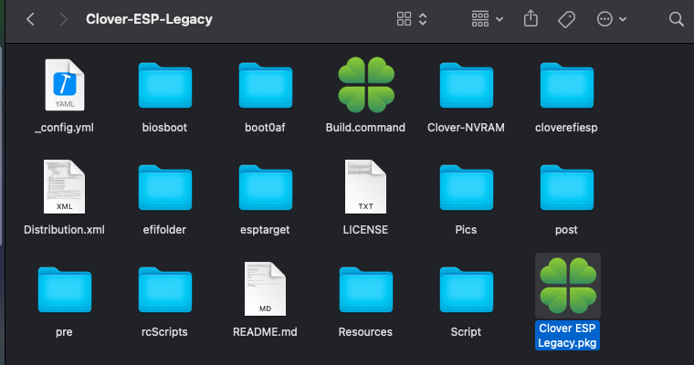

#### Welcome to the Clover ESP Legacy Package builder by chirs1111
[](https://github.com/chris1111/Clover-ESP-Legacy/actions/workflows/Build.yml)

- macOS Package Clover ESP specially designed for Legacy Bios-based configurations
- Make sur updating all kexts for new macOS version
- Default config.plist is for 10.6 to 10.13
- If you use Big Sur or Monterey rename the `config-BigSur-to-Monterey.plist` to config.plist

-----------------------------------
- Credit: [Clover Team](https://github.com/CloverHackyColor/CloverBootloader)


#### Build Package: Prerequisite:  
- `Git installed to clone this repos`

### Build Package from command in macOS


#### Clone and Build the repository
```bash

git clone https://github.com/chris1111/Clover-ESP-Legacy.git && cd $HOME/Clover-ESP-Legacy && ./Build.command
```

### Download from Artifacts ➥ [Build Package Actions](https://github.com/chris1111/Clover-ESP-Legacy/actions/workflows/Build.yml)

### Result



USAGE:
- Install the package to macOS USB Install Media, Install macOS then Install the Package to the macOS SSD to make it bootable without USB.
